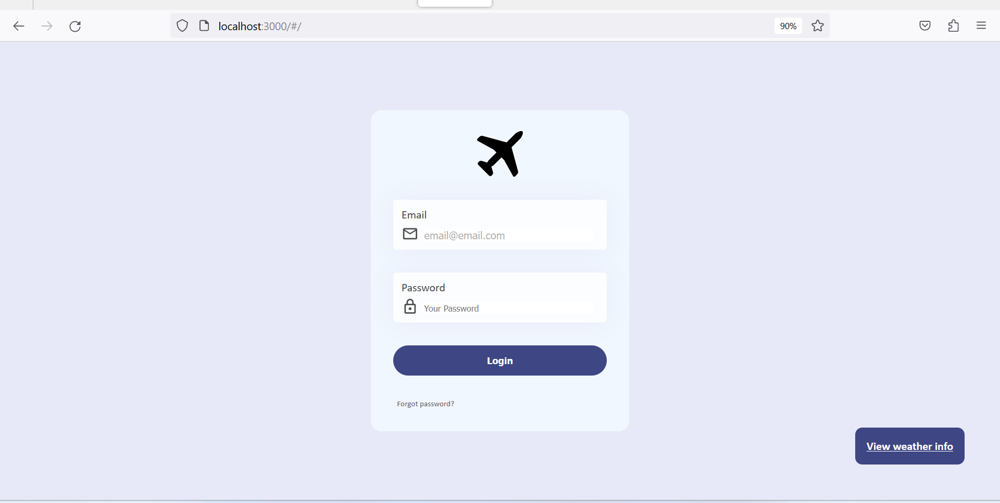
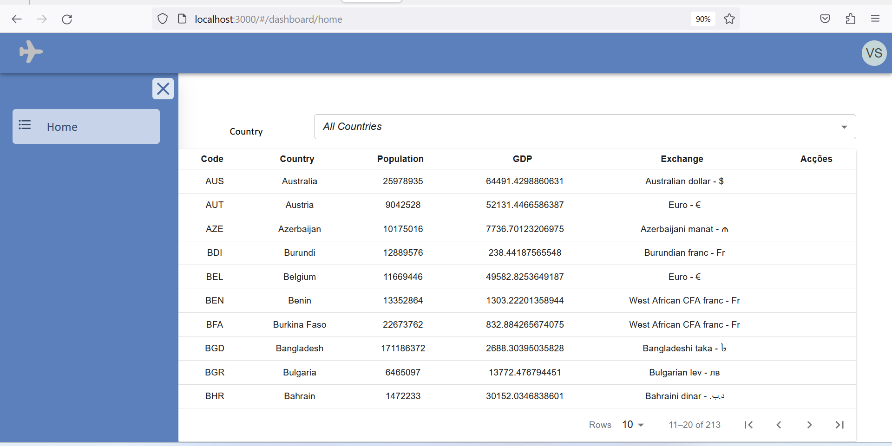
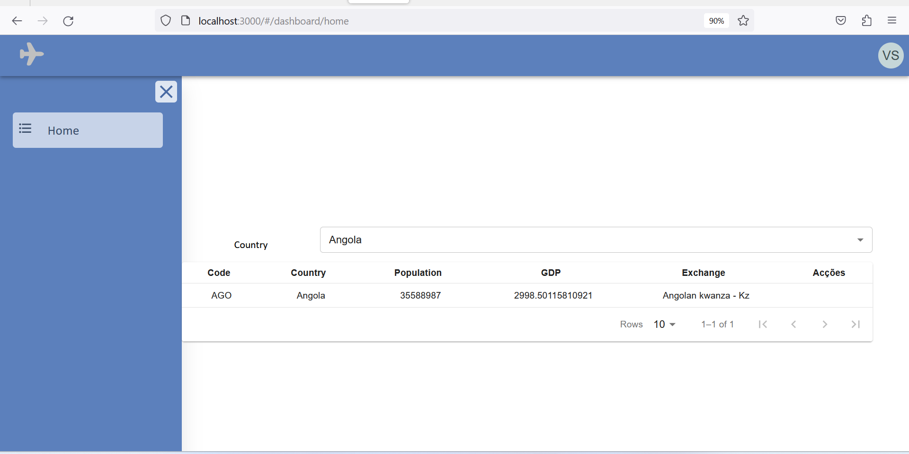

# vm-ui

# Requirements
- API running [Click here](https://github.com/50enta/vm-api.git) for more details
- NodJS 
-
 
## Setting up the app
1. Clone project repository:
```
git clone https://github.com/50enta/vm-ui.git -b main
```

2. Install dependencies
```
npm install --force
```
By running `npm install` is enough to ensure dependencies will be installed, but just to make sure I included `--force` arguments (depending on your node/npm version).

3. Execute project on development mode
```
npm start
```
The project will be running on port 3000: `http://localhost:3000`


Note:
> Didn't create .env file, the base url, token, etc to connect with API are managed on the code as well.
>> Also to make the authentication proccess easy, on login page validation are disabled. Just click login button and it will work.


## Application Workflow

Authentication Page


Weather information on button, right side.

## Main Page (Home)

By default get values for all countries.


Filtering by country:

